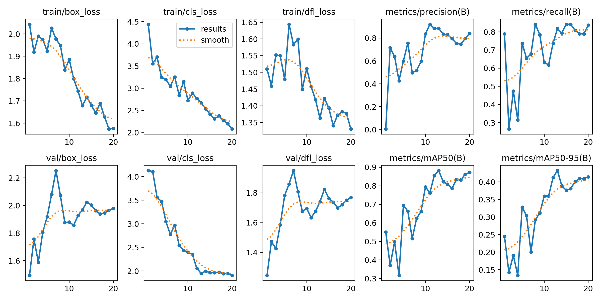
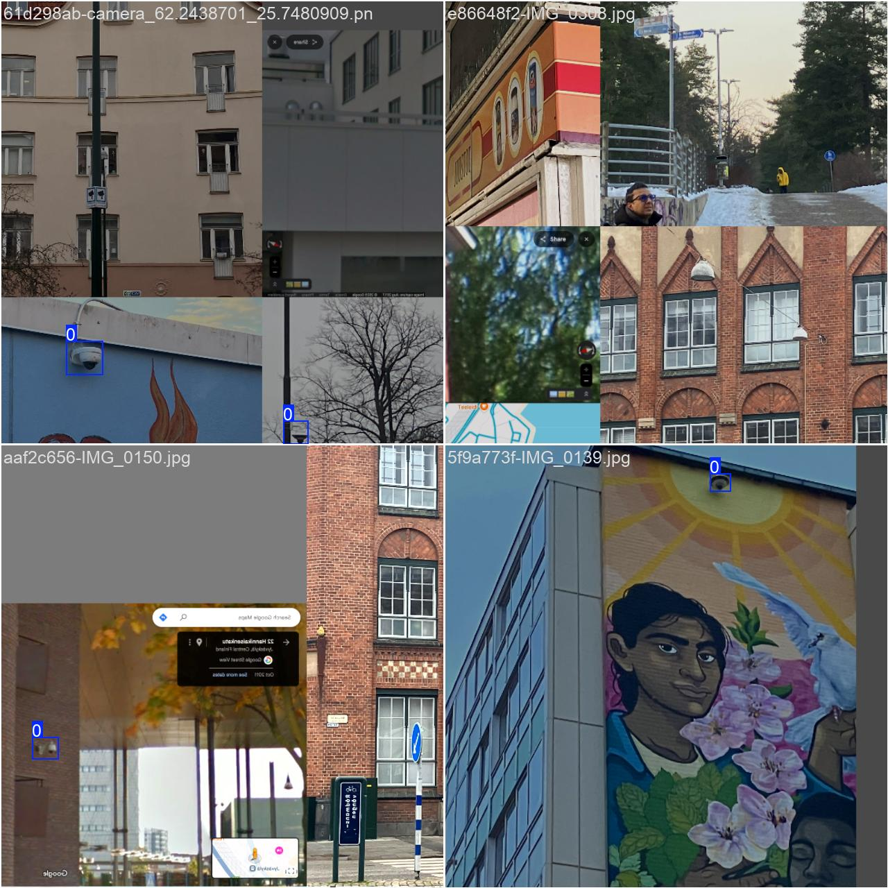
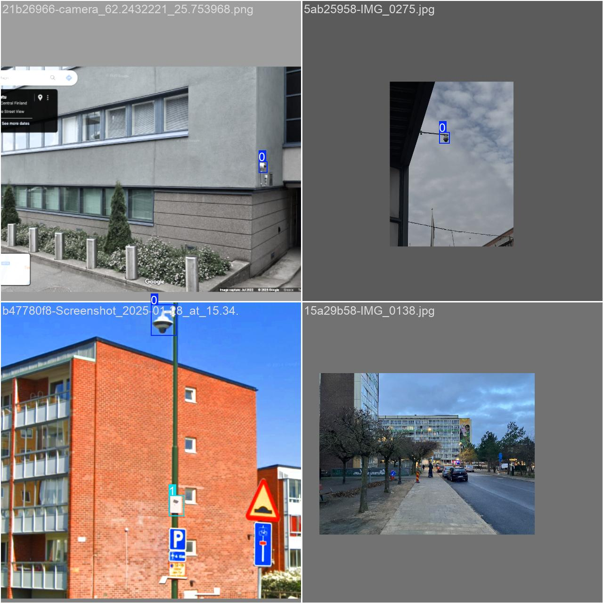
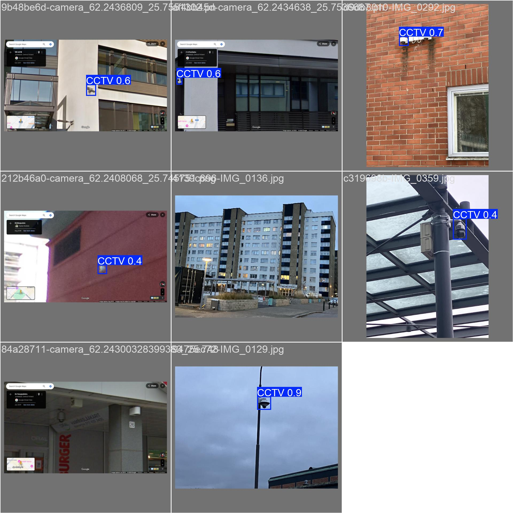
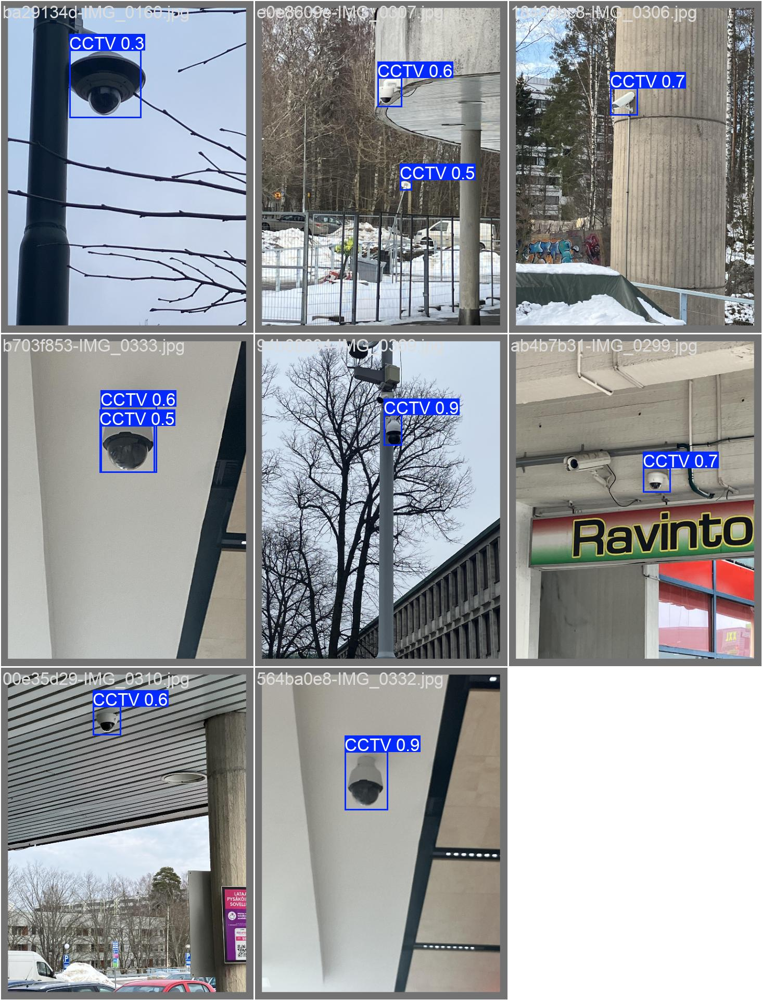

# CCTV Detection System

> This application is part of the Understanding Nordic Digital Order (UNDO) project.
> For more details visit the project's webpage [here](https://undo-project.info).

A multi-model object detection system for identifying CCTV cameras and signage using YOLOv8, Faster R-CNN, and DETR models.

## Features

- **Multi-Model Support**: Compare three state-of-the-art detection architectures
  - YOLOv8: Fast one-stage CNN detector
  - Faster R-CNN: Accurate two-stage CNN detector
  - DETR: Modern transformer-based detector
- **Interactive Web UI**: Gradio-based interface with model comparison
- **Performance Dashboard**: Training metrics visualization with interactive charts
  - Loss curves, mAP comparisons, and training summaries
  - Inference speed benchmarking across all models
- **Performance Metrics**: Real-time inference time and detection statistics
- **Example Gallery**: Pre-loaded sample images for quick testing

## Setup

This project uses [uv](https://github.com/astral-sh/uv) for fast, reliable package management (10-100x faster than pip).

### Install uv

If you don't have uv installed:

```bash
# macOS/Linux
curl -LsSf https://astral.sh/uv/install.sh | sh

# Or with pip
pip install uv
```

### Install Dependencies

```bash
# Sync all dependencies from pyproject.toml
uv sync

# Or install with all optional dependencies (dev, docs, mypy)
uv sync --all-extras
```

### Install Pre-commit Hooks

```bash
# Install hooks for automatic code formatting
uv run pre-commit install
```

## Configuration

The project uses centralized configuration in `src/config.py` with absolute paths resolved from the project root.

### Default Paths

All paths are automatically resolved relative to the project root:
- **YOLO weights**: `samples/best.pt`
- **Faster R-CNN weights**: `samples/fasterrcnn_best.pt`
- **DETR weights**: `samples/detr_best.pt`
- **Datasets**: `datasets/`
- **Training results**: `runs/`
- **Example images**: `examples/`

### Environment Variables

You can override defaults using environment variables with the `CCTV_` prefix:

| Variable | Description | Example |
|----------|-------------|---------|
| `CCTV_MODELS__YOLO_WEIGHTS` | YOLOv8 model weights | `/path/to/yolo.pt` |
| `CCTV_MODELS__FASTER_RCNN_WEIGHTS` | Faster R-CNN weights | `/path/to/fasterrcnn.pt` |
| `CCTV_MODELS__DETR_WEIGHTS` | DETR model weights | `/path/to/detr.pt` |
| `CCTV_TRAINING__EPOCHS` | Training epochs | `30` |
| `CCTV_TRAINING__BATCH_SIZE` | Batch size | `8` |

### Using .env File

Create a `.env` file in the project root to customize settings:

```bash
# .env
# Override model weights locations
CCTV_MODELS__YOLO_WEIGHTS=/path/to/yolo_model.pt
CCTV_MODELS__DETR_WEIGHTS=/path/to/detr_model.pt

# Override training parameters
CCTV_TRAINING__EPOCHS=30
CCTV_TRAINING__BATCH_SIZE=8
```

## User Interface

The application provides a comprehensive web interface for CCTV detection with multi-model comparison.

### Running the UI

```bash
# From project root (canonical entry point)
uv run python app.py

# OR use the console script
uv run cctv-ui
```

Then open your browser and visit: `http://127.0.0.1:7860`

### UI Features

The web interface includes five tabs:

1. **Single Model Detection**: Upload an image and select a model (YOLOv8, Faster R-CNN, or DETR) to run detection with adjustable confidence threshold

2. **Model Comparison**: Upload an image to see side-by-side results from all three models simultaneously with performance metrics

3. **Example Images**: Pre-loaded CCTV images for quick testing (click to load into Single Model tab)

4. **📊 Performance Dashboard**: View training metrics, loss curves, mAP comparisons, and model performance analytics
   - Training summary table showing epochs, mAP scores, and final losses
   - Interactive mAP comparison charts (mAP@0.5 and mAP@0.5:0.95)
   - Training history with loss curves for each model
   - Benchmark inference speed across all models

5. **About**: Model details, architecture information, and citation instructions

### Preparing Example Images

To populate the examples gallery with validation images:

```bash
# Copy 6 sample images from validation set to examples/
uv run cctv-prepare-examples

# OR run directly
uv run python scripts/prepare_examples.py
```

This will copy representative images to the `examples/` directory for use in the Gradio interface.

## Model Training

The project supports training multiple detection architectures on custom CCTV datasets.

### Training YOLOv8

```bash
# Train YOLOv8 model
uv run cctv-train

# OR run directly
uv run python scripts/train_yolo.py
```

Training configuration is managed via `src/config.py` and can be overridden with environment variables.

### Training DETR

```bash
# Train DETR transformer model
uv run cctv-train-detr

# OR run directly
uv run python scripts/train_detr.py
```

### YOLOv8 Training Results

Our custom-trained YOLOv8 model achieved strong performance after 20 epochs:

| Metric             | Value    |
|--------------------|----------|
| Epochs             | 20       |
| Precision (B)      | 0.841    |
| Recall (B)         | 0.838    |
| mAP@0.5 (B)        | 0.873    |
| mAP@0.5:0.95 (B)   | 0.415    |

#### Loss Curves

Training and validation losses decreased steadily with no major overfitting:
- Training Loss: ~8.0 → ~5.0
- Validation Loss: ~6.9 → ~5.7
- Stable gap indicates good generalization

#### Visualizations

<details>
<summary>Click to view training visualizations</summary>

**Results**


**Training Batch Samples**



**Validation Predictions**



</details>

## Image Labeling

To label images you need [Docker](https://www.docker.com) and [Label Studio](https://labelstud.io).

Pull the latest Label Studio image:

```bash
docker pull heartexlabs/label-studio:latest
```

Run the container:

```bash
docker run -it -p 8080:8080 -v $(pwd)/mydata:/label-studio/data heartexlabs/label-studio:latest
```

Open http://localhost:8080 in your browser. Create a username and password for local use.

## Testing

This project uses pytest for comprehensive testing with >65% code coverage.

### Running Tests

```bash
# Run all tests with uv
uv run pytest tests/

# Run with coverage report
uv run pytest tests/ --cov=src --cov-report=term-missing

# Run with HTML coverage report
uv run pytest tests/ --cov=src --cov-report=html
# Open htmlcov/index.html in browser

# Run specific test file
uv run pytest tests/infrastructure/test_detectors.py

# Run test pipeline script
bash local_test_pipeline.sh
```

### Test Structure

The test suite mirrors the source code structure:
```
tests/
├── domain/           # Domain layer tests (100% coverage)
├── application/      # Application layer tests (100% coverage)
├── infrastructure/   # Infrastructure layer tests (90%+ coverage)
└── ui/              # UI layer tests
```

### Test Coverage

Current coverage: **65%+** (137+ passing tests)
- Domain services: 100% coverage
- Application services: 100% coverage
- Infrastructure layer: 90%+ coverage

## Code Quality

This project uses automated tools to ensure code quality and consistency.

### Pre-commit Hooks (Required)

Install pre-commit hooks to automatically check code before committing:

```bash
uv run pre-commit install
```

The hooks will run:
- **Ruff linter** - Fast Python linting and code quality checks
- **Ruff formatter** - Automatic code formatting

### Manual Code Checks

```bash
# Run linter manually
uv run ruff check src/

# Run formatter manually
uv run ruff format src/

# Run all pre-commit hooks
uv run pre-commit run --all-files
```

### Optional: MyPy Type Checking

MyPy is available for optional local type checking:

```bash
# Run type checking (requires mypy extra)
uv run mypy src/
```

Type hints provide IDE support and documentation value. We rely on comprehensive test coverage and Ruff for code quality in the commit workflow.

## Console Scripts

The following console scripts are available after installation:

| Command | Description |
|---------|-------------|
| `uv run cctv-ui` | Launch Gradio web interface |
| `uv run cctv-train` | Train YOLOv8 model |
| `uv run cctv-train-detr` | Train DETR model |
| `uv run cctv-prepare-examples` | Prepare example images for UI |
| `uv run cctv-benchmark` | Benchmark inference speed across all models |

## Project Structure

```
cctv_detection/
├── app.py                    # Main entry point for UI
├── src/
│   ├── domain/              # Core business logic
│   ├── application/         # Application orchestration
│   ├── infrastructure/      # Concrete implementations
│   │   ├── detector_factory.py      # Model factory
│   │   ├── yolo_detector.py         # YOLO wrapper
│   │   ├── detr_detector.py         # DETR wrapper
│   │   └── faster_rcnn_detector.py  # Faster R-CNN wrapper
│   ├── ui/                  # User interfaces
│   │   └── gradio_app.py    # Multi-model Gradio UI
│   └── config.py            # Centralized configuration
├── scripts/                 # Training and utility scripts
├── tests/                   # Test suite
├── datasets/                # Training datasets
├── samples/                 # Model weights and visualizations
└── examples/                # Example images for UI
```

## Dataset & Model Access

Although most images used in training have been collected through ethnographic research, some images come from the [Fuziih CCTV-Exposure](https://github.com/Fuziih/cctv-exposure) dataset.

> **Contact us** if you want access to the full dataset or trained model weights.

## Citation

If you use this system in research, please cite:

```bibtex
@software{cctv_detection_2024,
  title={CCTV Detection System},
  author={UNDO Project},
  year={2024},
  url={https://github.com/jethronap/cctv_detection}
}
```

## License

CC0 1.0 Universal (Public Domain)